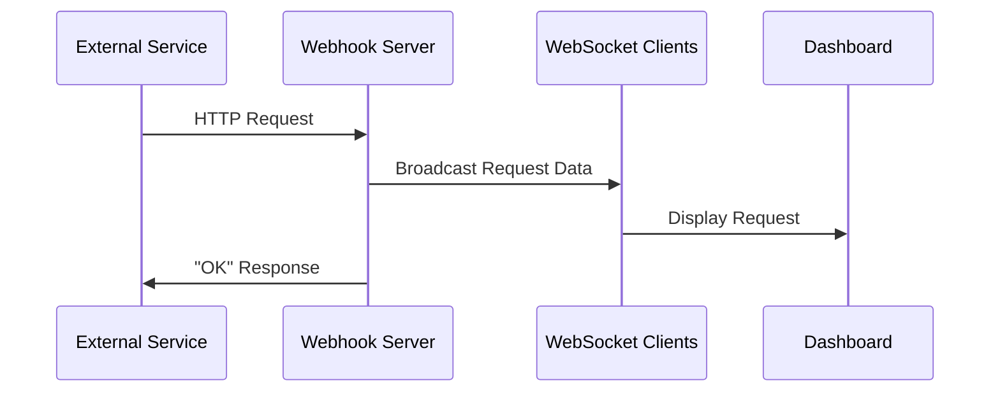

## Overview

The `webhook` command starts a specialized HTTP server that captures and displays incoming webhook requests in real-time. It automatically creates a Cloudflare tunnel and opens a web dashboard for inspecting requests.

## Syntax

```bash
ahh webhook
```

## Parameters

This command takes no parameters. It uses the default webhook port from your configuration.

## Usage Examples

<CodeGroup>
```bash Basic Usage
# Start a webhook server
ahh webhook
```

```bash Testing Webhooks
# Start the server
ahh webhook

# In another terminal, test with curl
curl -X POST https://your-tunnel-url.trycloudflare.com/webhook \
  -H "Content-Type: application/json" \
  -d '{"event": "test"}'
```

```bash Real-World Examples
# Test GitHub webhooks
ahh webhook
# Then configure the URL in GitHub webhook settings

# Debug Stripe webhooks
ahh webhook
# Use the URL for Stripe webhook endpoint

# Test Discord webhooks
ahh webhook
# Configure Discord to send events to the URL
```
</CodeGroup>

## Output

The command displays:
- A spinner: "Starting tunnel, this may take a second..."
- The webhook URL in cyan color
- Automatically opens the webhook dashboard in your browser

```bash Example Output
Starting tunnel, this may take a second...
Webhook URL https://random-subdomain.trycloudflare.com
```

## Dashboard Features

The web dashboard (at `https://cli.ahh.bet/webhook`) provides:
- Real-time webhook request monitoring
- Request details including:
  - HTTP method (GET, POST, PUT, DELETE, etc.)
  - Request path
  - Timestamp
  - Headers (filtered for privacy)
  - Query parameters
  - Request body
- Unique request IDs for tracking

## How It Works

### Server Architecture

1. **HTTP Server**: Accepts all HTTP methods on all paths
2. **WebSocket Connection**: Streams request data to the dashboard
3. **Token Authentication**: Secures the WebSocket connection with a UUID token
4. **Request Capture**: Logs all incoming requests with full details

### Request Flow



### Authentication

The dashboard authenticates via:
- A random UUID token generated on server start
- Token embedded in the dashboard URL
- WebSocket connection requires token verification
- Unauthorized connections are terminated

## Request Data Captured

Each webhook request captures:

```typescript
{
  id: string,              // Unique UUID for this request
  method: string,          // HTTP method (GET, POST, etc.)
  path: string,            // Request path
  timestamp: string,       // ISO 8601 timestamp
  headers: object,         // HTTP headers (filtered)
  query: object,           // Query parameters
  body: string | object    // Request body
}
```

### Header Filtering

<Note>
  For privacy and clarity, the following headers are filtered out:
  - Headers starting with `cf-` (Cloudflare headers)
  - Headers starting with `x-forwarded` (proxy headers)
  - `cdn-loop` header
</Note>

## Default Configuration

The webhook server uses the `DEFAULT_WEBHOOK_HTTP_PORT` from your Ahh configuration file. You can modify this in your config.

## Technical Details

### Implementation

Built with:
- **Elysia** - HTTP server framework
- **WebSocket** - Real-time communication
- **CORS** - Restricted to `cli.ahh.bet` domain

### WebSocket Endpoint

The WebSocket endpoint is at `/ws` and:
- Requires token authentication via first message
- Broadcasts to all connected clients
- Automatically cleans up closed connections
- Returns "OK" on successful auth

### All HTTP Methods Supported

The server accepts:
- GET
- POST
- PUT
- DELETE
- PATCH
- HEAD
- OPTIONS
- Any other HTTP method

## Return Value

The underlying `createWebhookServer()` function returns:
```typescript
{
  token: string,       // Authentication token (UUID)
  port: number,        // Server port
  kill: () => void     // Function to stop the server
}
```

## Error Handling

### Tunnel Creation Failure

If the tunnel fails to create:
```
Failed to create tunnel.
```
The command exits without opening the dashboard.

### WebSocket Connection Errors

Unauthorized WebSocket connections are:
- Immediately terminated
- Not added to the client list
- Not able to receive request data

## Notes

<Note>
  The webhook server responds with "OK" to all requests, making it suitable for services that expect a 200 response.
</Note>

<Note>
  All request data is only streamed to connected dashboard clients. No data is persisted to disk.
</Note>

<Warning>
  The webhook URL is public. Anyone with the URL can send requests to your server. Don't use this for production or sensitive data.
</Warning>

## Related Commands

- [tunnel](/commands/tunnel) - Create a basic tunnel
- [serve](/commands/serve) - Serve static files with tunneling
